# Build log — 2026-10-08

Single-shot build, about 2.5 hours wall clock. Everything below runs; screenshots and the GIF in this folder were captured from a Pixel 8 (API 35, arm64) emulator talking to the server.

## What exists

| Part | Where | State |
|---|---|---|
| Web app + API (Next.js 15, `pg`) | `server/` | Deployed to Vercel production: https://pod-talk-silk.vercel.app, Neon Postgres, schema auto-applied on first request (`/api/health` reports `db: true`). Smoke script `server/scripts/smoke.sh` passes 21/21 against local dev. |
| Rust core (`podtalk-core`) | `core/` | whisper.cpp transcription (segment + token timestamps), audio decode/resample, RMS silence trim, filler-word removal with timestamps, BM25 extractive answers, JNI bridge. Unit tests pass; builds for Android arm64 with `core/build-android.sh`. |
| Android app (Kotlin, Compose, Media3) | `android/` | Queue sync, download, on-device transcription + sync, player, voice interrupt (desert-ant Clear → whisper → answer → TTS), typed questions, conversation sync with audio positions and segment ranges. Release APK built against the production URL. |

## Desert Ant on Android — what was done about it

Desert Ant's Kotlin SDK (Maven Central, `ai.desertant:*:3.6.0`) ships Clear, Ear, Emo, Gist, Moderator, Redact, Shapes and Tongue for Android (API 24+, arm64-v8a/x86_64, LiteRT). **Voz and Uhm are not available on Android** (docs: "There is no Android or Linux build"; Uhm needs Apple silicon).

- **Clear**: used directly (`ai.desertant:clear:3.6.0`). The listener's question is enhanced on-device before transcription. Verified on the emulator: LiteRT + XNNPACK load, an 11 s clip enhanced in ~3.5 s.
- **Voz → whisper.cpp in Rust** (`whisper-rs`, `ggml-tiny.en` by default, `base.en` selectable). Fully offline, segment timestamps, token timestamps used for filler spans. 11 s clip transcribed in 6–8 s on the emulator; a Pixel 8 is far faster.
- **Uhm → Rust filler stripper** over whisper's per-token timestamps (`uh/um/hmm/erm/…` plus stutter repeats). Removed spans are reported with start/end ms.
- **Reply generation**: `POST /api/answer` calls Claude Haiku 4.5 when `ANTHROPIC_API_KEY` is set on Vercel (not set, so no spend). Without it the app falls back to the Rust BM25 extractive answer over the transcript near the playback position, which is what the screenshots show (`bm25-local`).

## Flow as verified

1. Web: add an RSS feed (Darknet Diaries parsed, 181 episodes), add an episode to the queue, or upload audio (Vercel Blob client upload; needs `BLOB_READ_WRITE_TOKEN`, see below).
2. App: queue syncs. "Download + transcribe" downloads the audio, runs whisper on-device in 5-minute chunks, saves locally and `PUT`s the transcript to the server (`transcript.synced` webhook).
3. App: Listen → playback with the current transcript line shown. Tap **Ask or comment** → playback pauses (`conversation.paused`), the mic records until ~1.2 s of silence, Clear cleans it, Rust trims silence, whisper transcribes with fillers stripped, an answer is produced (server LLM or on-device BM25), spoken by TTS, both turns are posted (`question.created`, `response.created`) with `audio_position_ms` and the `segment_start_ms–segment_end_ms` of the part of the episode they were about, and playback resumes (`conversation.resumed`).
4. Web: the Conversations page shows turns with mm:ss positions and segment ranges; referenced transcript segments are highlighted. The Webhooks page shows signed deliveries (HMAC-SHA256 `X-PodTalk-Signature`).

Webhook deliveries observed during the demo (local sink, all HTTP 200): `conversation.started`, `conversation.paused`, `question.created`, `response.created`, `conversation.resumed`, `transcript.synced`, `webhook.test`.

## Screenshots

| | |
|---|---|
| 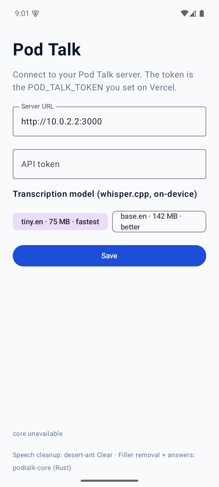 | 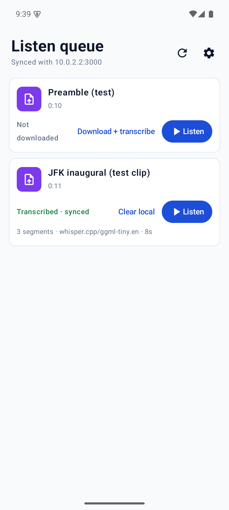 |
| 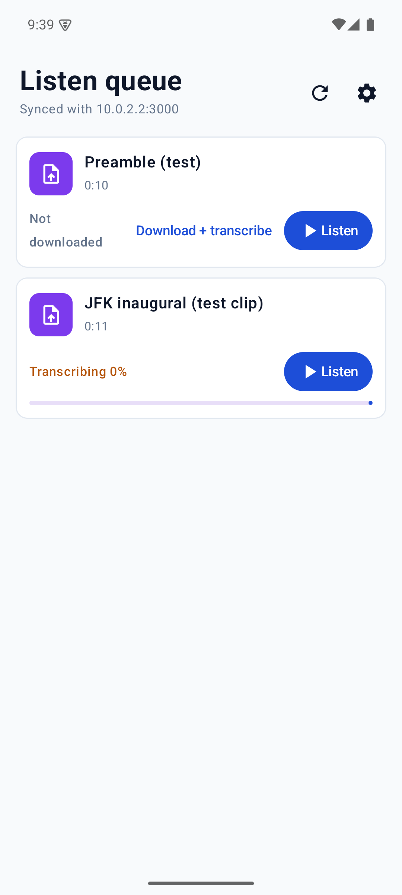 | 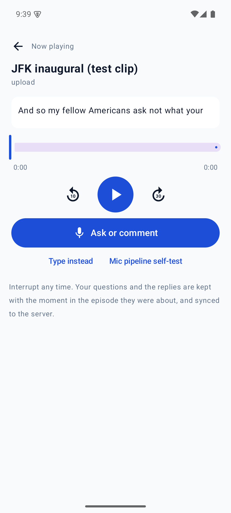 |
| 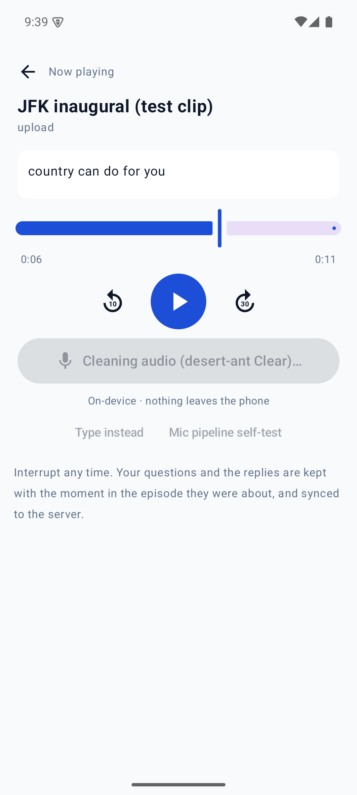 | 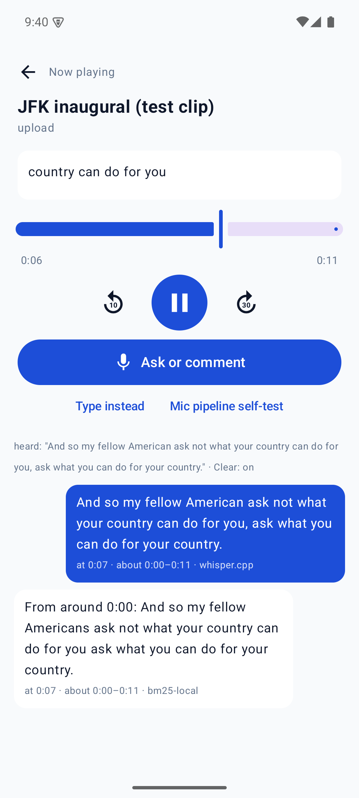 |
| 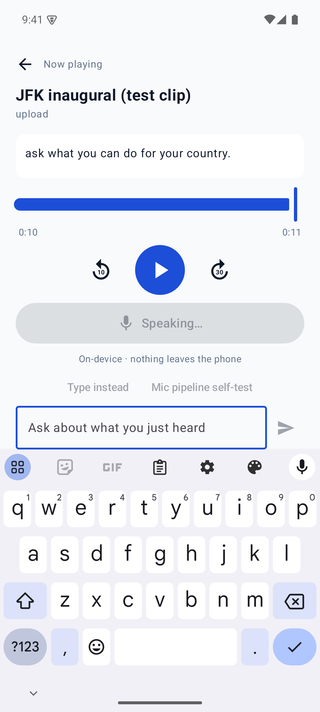 | |

Web: 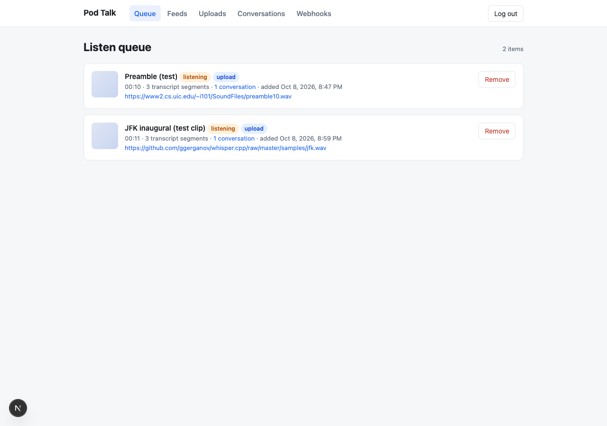 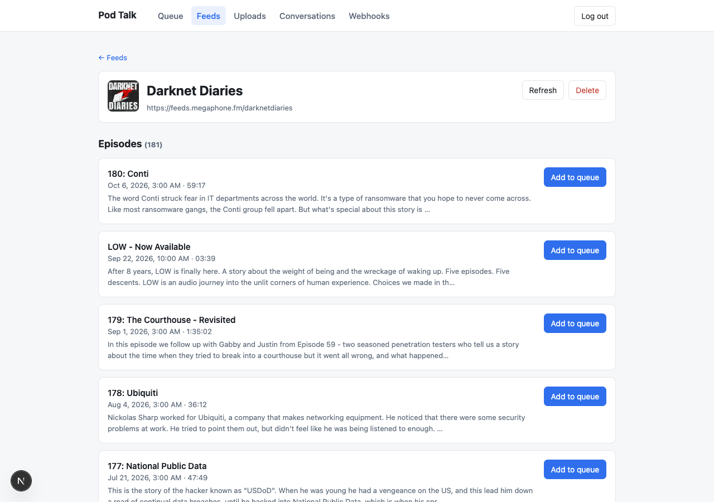 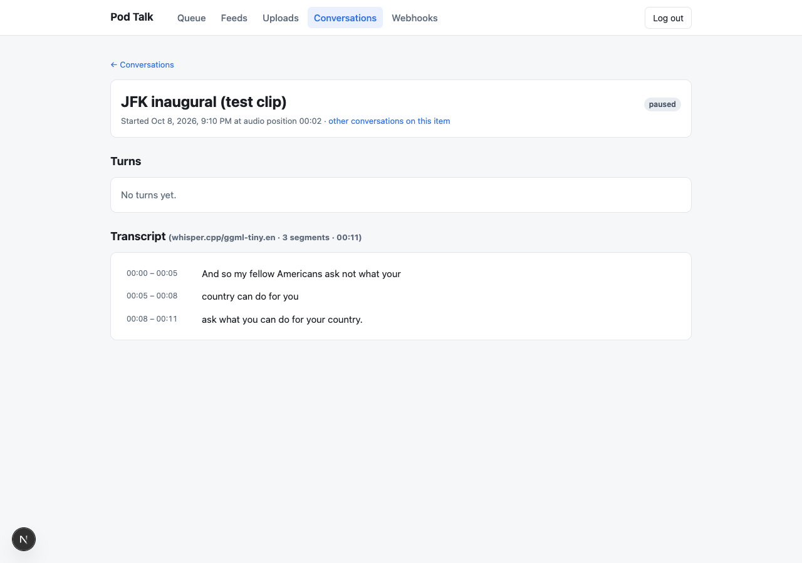 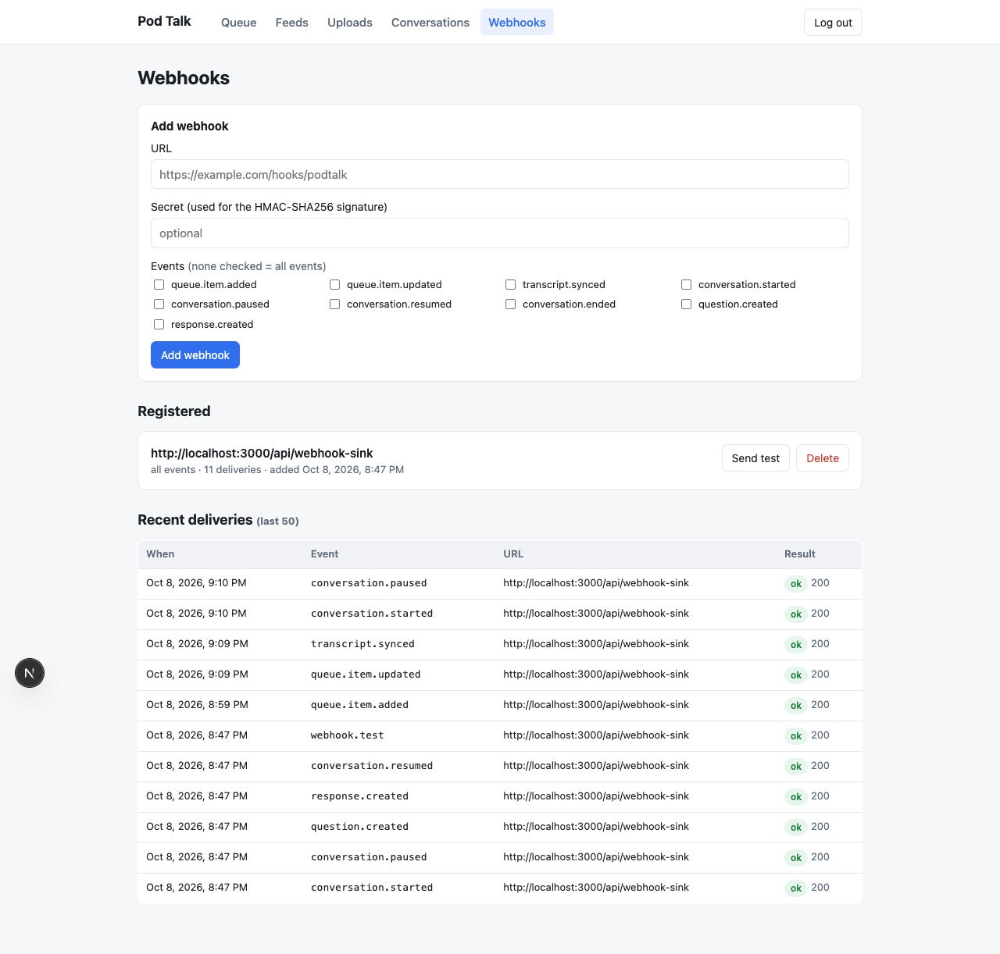

## GIF

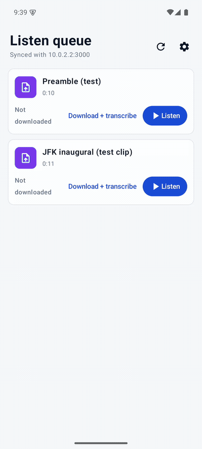

2.5× speed; `demo-full-flow.mp4` is the same recording. Sequence: download + transcribe → listen → mic-pipeline self-test (the bundled JFK clip pushed through Clear → whisper → answer) → typed question.

## Problems hit and how they were solved

- Homebrew JDK casks need sudo and the formula builds from source on this macOS; used an Adoptium tarball in `~/jdk`.
- Local Postgres: only `libpq` was installed; `embedded-postgres` (npm) runs a local server on 5433 for dev.
- Neon via the Vercel marketplace needs a one-time human terms acceptance; the DB and env vars were created by hand instead.
- whisper-rs-sys for Android: the NDK toolchain file defaults to armeabi-v7a; CMake's built-in Android support (`CMAKE_SYSTEM_NAME=Android`, `CMAKE_ANDROID_ARCH_ABI`) works. Its build script also links `ggml-blas` whenever the *host* is macOS, so the build script supplies an empty stub archive. whisper.cpp needs `libc++_shared.so`, now bundled.
- Clear's first `Clear(context)` must not run on the main thread (ANR).
- On the 4-vCPU emulator with a software GPU, an animated progress indicator starved ggml's spin-barrier threads: 72 s instead of 8 s for an 8 s clip, and Clear went from 28 s to 3.5 s once the UI was static. The busy state is now static and whisper uses `cores - 2` threads.
- `adb input text` into Compose fields drops characters; the typed-question demo types word by word.

## Not done / needs you

- `ANTHROPIC_API_KEY` on Vercel for generated replies: `cd server && vercel env add ANTHROPIC_API_KEY production`. The fallback works without it.
- Uploads: Blob store `pod-talk-audio` created and linked (`BLOB_READ_WRITE_TOKEN` set, within the Pro plan's included usage). Real upload through the browser was not exercised by me.
- Install on the Pixel 8: `adb install android/app/build/outputs/apk/release/app-release.apk` (a GitHub release upload was blocked by the session's permission policy, so install from the local build), then enter the server URL (pre-filled with production) and the `POD_TALK_TOKEN` (kept in `~/.podtalk-token` on this Mac; it is the same value set on Vercel). Log in to the web app with the same token.
- A real-mic run was not possible on the emulator; the identical pipeline was exercised through the bundled clip ("Mic pipeline self-test" button, kept in the app on purpose).

## Review pass — 2026-10-08, later

Two reviewer agents went over the server and the app/core, then applied their own fixes.

- Server (`56a1bef`): idempotent uploads via a partial unique index, strict int validation on every ms/duration field (400 instead of 500), webhook delivery moved off the request path with `waitUntil`, advisory-locked schema apply, RSS fixes (relative enclosure URLs, image `media:content`, Atom enclosures, RSS 1.0, duration edge cases), batched episode upserts, constant-time token compare, verified TLS to Neon. Smoke: 30/30.
- App + core (`efc5ce9`): streaming resampler (long episodes no longer decode into RAM at source rate), UTF-8-safe truncation, foreground `MediaSessionService` with audio focus and wake mode so playback survives screen-off, whisper context behind an `Arc` so questions aren't blocked by background transcription, 2 s chunk overlap, silence gating so an empty question isn't hallucinated, resumable downloads with retry, mic permission requested at the point of use, `conversation.ended` actually sent, cleartext limited to the dev host. Verified on the emulator including screen-off playback.
- Also found during the pass: the `POD_TALK_TOKEN` on Vercel did not match the saved token (production rejected the app). Re-set and verified.
